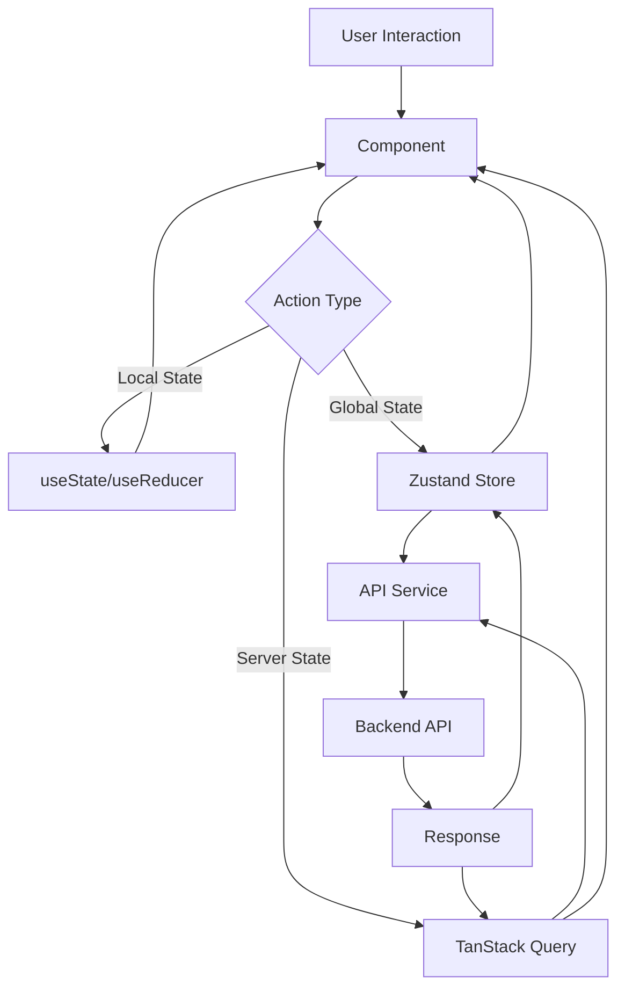

# 🏗️ Architecture Frontend - Enterprise OS

## 📋 Vue d'Ensemble

L'architecture de ce frontend moderne suit les principes **SOLID**, **DRY** et **KISS** pour créer une application maintenable, scalable et performante.

## 🎯 Principes Architecturaux

### 1. **Separation of Concerns**
- Logique métier séparée de la présentation
- État global distinct de l'état local
- Services API isolés des composants

### 2. **Component-Based Architecture**
- Composants atomiques réutilisables
- Composition over inheritance
- Props drilling minimal (Context API)

### 3. **Type Safety First**
- TypeScript strict mode
- Types générés depuis l'API
- Validation runtime avec Zod

### 4. **Performance by Design**
- Code splitting automatique
- Lazy loading systématique
- Memoization stratégique

## 📁 Structure des Dossiers

```
src/
├── app/                      # Application core
│   ├── router/              # Configuration du routage
│   │   ├── routes.tsx      # Définition des routes
│   │   ├── guards.tsx      # Route guards
│   │   └── index.tsx       # Router provider
│   ├── providers/          # Context providers
│   │   ├── ThemeProvider.tsx
│   │   ├── AuthProvider.tsx
│   │   └── index.tsx
│   └── store/              # État global
│       ├── auth.store.ts
│       ├── ui.store.ts
│       └── index.ts
│
├── features/               # Modules fonctionnels
│   ├── auth/              # Module d'authentification
│   │   ├── components/
│   │   ├── hooks/
│   │   ├── services/
│   │   ├── types/
│   │   └── index.ts
│   ├── dashboard/
│   ├── projects/
│   ├── hr/
│   └── finance/
│
├── components/            # Composants partagés
│   ├── ui/               # Design system
│   │   ├── button/
│   │   ├── input/
│   │   └── ...
│   ├── forms/            # Composants de formulaire
│   ├── charts/           # Visualisations
│   └── layouts/          # Layouts réutilisables
│
├── hooks/                # Custom React hooks
│   ├── useAuth.ts
│   ├── useTheme.ts
│   └── ...
│
├── services/             # Services & API
│   ├── api/             # API clients
│   ├── auth/            # Auth service
│   └── storage/         # Local storage
│
├── utils/               # Fonctions utilitaires
│   ├── formatters/      # Format des données
│   ├── validators/      # Validation helpers
│   └── constants/       # Constantes globales
│
├── types/               # Types TypeScript
│   ├── api.types.ts    # Types API
│   ├── ui.types.ts     # Types UI
│   └── global.d.ts     # Types globaux
│
└── styles/              # Styles globaux
    ├── globals.css     # CSS global
    └── themes/         # Thèmes
```

## 🔄 Data Flow Architecture



## 🧩 Component Architecture

### Atomic Design Pattern

```
Atoms       → Buttons, Inputs, Labels
Molecules   → Form Fields, Card Headers
Organisms   → Forms, Navigation, Cards
Templates   → Page Layouts
Pages       → Full Pages
```

### Component Structure

```typescript
// button/button.tsx
import { forwardRef } from 'react'
import { cn } from '@/utils/cn'
import type { ButtonProps } from './button.types'
import { buttonVariants } from './button.variants'

export const Button = forwardRef<HTMLButtonElement, ButtonProps>(
  ({ className, variant, size, ...props }, ref) => {
    return (
      <button
        ref={ref}
        className={cn(buttonVariants({ variant, size }), className)}
        {...props}
      />
    )
  }
)

Button.displayName = 'Button'
```

## 🔐 State Management Strategy

### 1. **Local State** (Component State)
- Form inputs
- UI toggles
- Temporary data

### 2. **Global State** (Zustand)
```typescript
// stores/auth.store.ts
interface AuthState {
  user: User | null
  isAuthenticated: boolean
  login: (credentials: LoginCredentials) => Promise<void>
  logout: () => void
}

export const useAuthStore = create<AuthState>((set) => ({
  user: null,
  isAuthenticated: false,
  login: async (credentials) => {
    const user = await authService.login(credentials)
    set({ user, isAuthenticated: true })
  },
  logout: () => {
    authService.logout()
    set({ user: null, isAuthenticated: false })
  }
}))
```

### 3. **Server State** (TanStack Query)
```typescript
// hooks/useProjects.ts
export const useProjects = () => {
  return useQuery({
    queryKey: ['projects'],
    queryFn: projectService.getAll,
    staleTime: 5 * 60 * 1000, // 5 minutes
    cacheTime: 10 * 60 * 1000, // 10 minutes
  })
}

export const useCreateProject = () => {
  const queryClient = useQueryClient()
  
  return useMutation({
    mutationFn: projectService.create,
    onSuccess: () => {
      queryClient.invalidateQueries({ queryKey: ['projects'] })
    }
  })
}
```

## 🚦 Routing Architecture

### Route Configuration
```typescript
// router/routes.tsx
export const routes = [
  {
    path: '/',
    element: <RootLayout />,
    children: [
      {
        index: true,
        lazy: () => import('@/pages/home'),
      },
      {
        path: 'auth',
        element: <AuthLayout />,
        children: [
          {
            path: 'login',
            lazy: () => import('@/features/auth/pages/login'),
          },
        ],
      },
      {
        path: 'dashboard',
        element: <ProtectedRoute />,
        children: [
          {
            path: ':role',
            lazy: () => import('@/features/dashboard/pages/role-dashboard'),
          },
        ],
      },
    ],
  },
]
```

## 🔒 Security Architecture

### Authentication Flow
1. User login → JWT token
2. Token stored in httpOnly cookie
3. Refresh token rotation
4. Auto logout on inactivity

### Authorization
```typescript
// components/ProtectedRoute.tsx
export const ProtectedRoute = ({ requiredRole }: Props) => {
  const { user, isAuthenticated } = useAuth()
  
  if (!isAuthenticated) {
    return <Navigate to="/auth/login" />
  }
  
  if (requiredRole && !hasRole(user, requiredRole)) {
    return <Navigate to="/unauthorized" />
  }
  
  return <Outlet />
}
```

## 🚀 Performance Architecture

### Code Splitting
```typescript
// Automatic route-based splitting
const ProjectsModule = lazy(() => 
  import(/* webpackChunkName: "projects" */ '@/features/projects')
)
```

### Optimization Strategies
1. **React.memo** for expensive components
2. **useMemo/useCallback** for expensive computations
3. **Virtual scrolling** for large lists
4. **Image lazy loading** with IntersectionObserver
5. **Debouncing** for search inputs

## 🧪 Testing Architecture

### Testing Pyramid
```
         E2E (Playwright)
        /               \
    Integration Tests    \
   /                      \
Unit Tests (Vitest)      /
```

### Test Structure
```typescript
// button.test.tsx
describe('Button', () => {
  it('renders with correct variant', () => {
    render(<Button variant="primary">Click me</Button>)
    expect(screen.getByRole('button')).toHaveClass('btn-primary')
  })
})
```

## 🔌 API Integration Architecture

### API Client Setup
```typescript
// services/api/client.ts
export const apiClient = ky.create({
  prefixUrl: import.meta.env.VITE_API_URL,
  hooks: {
    beforeRequest: [
      (request) => {
        const token = authService.getToken()
        if (token) {
          request.headers.set('Authorization', `Bearer ${token}`)
        }
      },
    ],
    afterResponse: [
      async (request, options, response) => {
        if (response.status === 401) {
          await authService.refreshToken()
          return ky(request)
        }
      },
    ],
  },
})
```

## 📱 Responsive Architecture

### Breakpoints
```typescript
// utils/breakpoints.ts
export const breakpoints = {
  sm: '640px',
  md: '768px',
  lg: '1024px',
  xl: '1280px',
  '2xl': '1536px',
}
```

### Mobile-First Approach
```css
/* Base styles (mobile) */
.container {
  padding: 1rem;
}

/* Tablet and up */
@media (min-width: 768px) {
  .container {
    padding: 2rem;
  }
}
```

## 🎨 Theming Architecture

### Theme Structure
```typescript
// styles/themes/theme.types.ts
interface Theme {
  colors: {
    primary: ColorScale
    neutral: ColorScale
    semantic: SemanticColors
  }
  spacing: SpacingScale
  typography: TypographyScale
  shadows: ShadowScale
  animations: AnimationScale
}
```

## 🔧 Build Architecture

### Vite Configuration
```typescript
// vite.config.ts
export default defineConfig({
  build: {
    rollupOptions: {
      output: {
        manualChunks: {
          'react-vendor': ['react', 'react-dom'],
          'ui-vendor': ['@radix-ui/*', 'framer-motion'],
          'utils': ['date-fns', 'zod'],
        },
      },
    },
  },
})
```

## 📊 Monitoring Architecture

### Performance Monitoring
- Web Vitals tracking
- Error boundary reporting
- User interaction tracking
- API response time monitoring

### Analytics Integration
```typescript
// services/analytics.ts
export const analytics = {
  track: (event: string, properties?: Record<string, any>) => {
    if (import.meta.env.PROD) {
      // Google Analytics, Mixpanel, etc.
    }
  },
}
```

---

*Cette architecture est conçue pour évoluer avec les besoins du projet tout en maintenant une base solide et performante.*